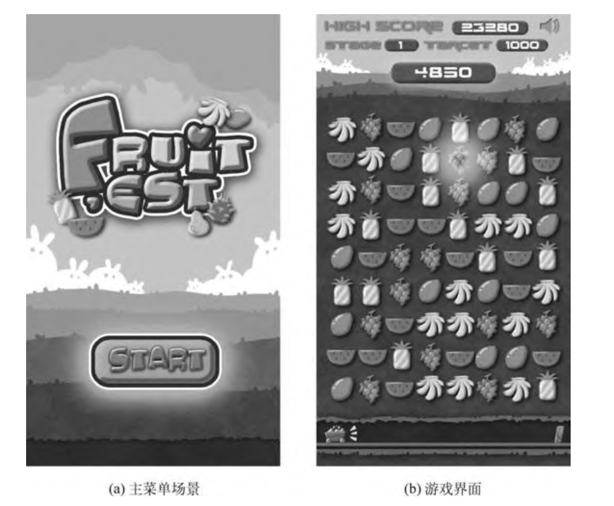

# 开心消消乐 

一直以来，消除类游戏以其简单明快的节奏、浓厚的趣味性和智 慧性而被广大玩家所喜爱。像糖果传奇、开心消消乐、消灭星星等消 除游戏都是老少皆宜以致风靡全国的。

首先对游戏的核心玩法做分析，然后就游戏需要 的场景进行解析，最后实现游戏的第一个场景，即主菜单界面。 

# 消消乐的游戏玩法 

1. 单击水果时，如果该水果相邻处有同类型的水果，那么就高 亮显示这些水果;反之不高亮。
2. 显示可能获得的分数。
3. 再次单击被高亮的水果，就消除它们并获得分数。
4. 产生新的水果并掉落下来补全空缺。 
5. 本游戏有不同的关卡，每关都有给定的通关分数，玩家达到指定分数才能通关。 

# 美术设计

美术需要根据游戏的设定来设计游戏的场 景与元素，并拆分成程序需要的元件。 

小的元件可以用TexturePacker打包，这样有利于速度优化(本书序列帧动画相关知识有说明)。

背景图片等大图不建议用TexturePacker打包，否则打包的 资源很有可能会超出硬件设备对纹理最大尺寸的限制。 

虽然花费了大量时间来分析算法，但这是很有必要的，游戏与应 用不同，游戏的核心就是算法与随机数，缺少了该两者，游戏将枯燥 乏味。编码仅仅是帮助我们实现梦想的工具，而不能局限于编码。
